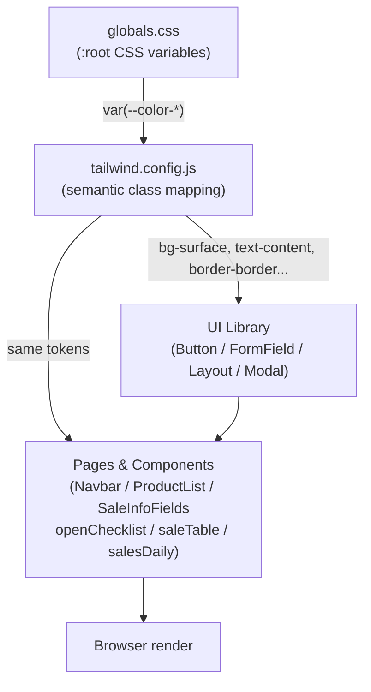

# Design Document — UI Style Standardization

## Overview

La migración reemplaza todas las clases de Tailwind hardcodeadas (escalas numéricas de color y valores arbitrarios `[#hex]`) en seis archivos del dashboard por los **Design Tokens** semánticos definidos en `globals.css` y mapeados en `tailwind.config.js`, y sustituye elementos HTML nativos por los componentes de la **UI Library** (`Button`, `Input`, `Select`, `Textarea`, `PageContainer`, `Modal`) donde aplique.

El objetivo es que cualquier cambio de tema (paleta de colores, radios, tipografía) quede confinado exclusivamente a `globals.css`, sin tocar ningún componente.

**Alcance de archivos:**
- `src/components/Navbar.jsx`
- `src/components/ProductList.jsx`
- `src/components/SaleInfoFields.jsx`
- `src/app/dashboard/openChecklist/page.jsx`
- `src/app/dashboard/saleTable/page.js`
- `src/app/dashboard/salesDaily/page.js`

**Restricciones globales:**
- No se modifica ninguna lógica de negocio, estado, fetch, ni estructura de props.
- Los colores inline de Recharts (constantes JS) no se tocan.
- Navbar permanece como Server Component (`async`); Button es `"use client"` — se resuelve con un wrapper.


## Architecture

La migración es puramente de presentación. No hay nuevas capas, rutas de API, ni cambios en el schema de Prisma. El diagrama muestra cómo el sistema de tokens conecta `globals.css` con los componentes finales:



**Principio de cambio único:** Para modificar el color de cualquier superficie, basta con editar el valor de la variable CSS en `globals.css`. Todos los componentes que usen `bg-surface` se actualizan sin tocar JSX.

**Componentes auxiliares nuevos:**
- `src/components/ui/NavButton.jsx` — Client Component mínimo que envuelve un `<Link>` de Next.js con el estilo visual de `Button`, resolviendo la restricción Server Component de Navbar.


## Components and Interfaces

### UI Library existente (sin cambios internos)

| Componente | Props relevantes | Notas |
|---|---|---|
| `Button` | `variant`, `size`, `icon`, `fullWidth`, `className`, `...props` | No acepta `href`; para links se usa `NavButton` |
| `Input` | `label`, `id`, `ref`, `value`, `onChange`, `...props` | `ref` se pasa via `...props` |
| `Select` | `label`, `id`, `value`, `onChange`, `children`, `...props` | Misma API que `Input` |
| `Textarea` | `label`, `id`, `value`, `onChange`, `...props` | Misma API que `Input` |
| `PageContainer` | `children`, `maxWidth` | Aplica `min-h-screen bg-canvas text-content p-4 md:p-6` |
| `Modal` | `open`, `onClose`, `title`, `children`, `maxWidth` | Cierra al hacer clic en overlay; bloqueo de scroll lo gestiona el padre |
| `Card` | `className`, `children` | `bg-surface border border-border rounded-card` |

### Nuevo: `NavButton.jsx`

```jsx
// src/components/ui/NavButton.jsx
"use client";
import Link from "next/link";

const VARIANTS = {
  primary: "bg-primary hover:bg-primary-hover text-white",
  ghost: "text-content hover:text-content-muted",
};

export default function NavButton({ href, variant = "primary", children }) {
  return (
    <Link
      href={href}
      className={`inline-flex items-center justify-center gap-2 rounded-control
        font-medium px-4 py-2 transition ${VARIANTS[variant]}`}
    >
      {children}
    </Link>
  );
}
```

**Decisión de diseño:** Se prefiere un componente propio (`NavButton`) sobre el patrón `asChild` (que requeriría `@radix-ui/react-slot` u otro paquete externo) para no añadir dependencias. `NavButton` reutiliza los mismos tokens que `Button` y mantiene Navbar como Server Component puro.


## Data Models

No hay cambios en modelos de datos. La migración no toca el schema de Prisma, las respuestas de API, ni los tipos/interfaces de los componentes. Las props de cada componente permanecen idénticas — la migración es transparente para los padres que los consumen.

---

## Token Mapping — Hardcoded → Semántico

Esta tabla es la referencia central para todas las sustituciones. Aplica uniformemente a todos los archivos del alcance.

### Fondos

| Clase hardcoded | Token semántico | CSS variable | Valor actual |
|---|---|---|---|
| `bg-gray-950` | `bg-canvas` | `--color-canvas` | `#030712` |
| `bg-[#0b0f12]` | `bg-canvas` | `--color-canvas` | `#030712` |
| `bg-gray-900` | `bg-surface` | `--color-surface` | `#111827` |
| `bg-[#060708]` | `bg-surface` | `--color-surface` | `#111827` |
| `bg-gray-800` | `bg-surface-hover` | `--color-surface-hover` | `#1f2937` |
| `bg-[#050607]` | `bg-surface-hover` | `--color-surface-hover` | `#1f2937` |
| `bg-gray-700` | `bg-surface-hover` | `--color-surface-hover` | `#1f2937` |
| `bg-emerald-700` (botón acción primaria) | `bg-primary` | `--color-primary` | `#2563eb` |
| `bg-blue-800` (botón transferencias) | `bg-primary` | `--color-primary` | `#2563eb` |
| `bg-blue-500` / `bg-blue-600` (botón secundario) | `variant="secondary"` en `Button` | — | via componente |
| `bg-emerald-700` (botón éxito) | `bg-success-hover` / `variant="success"` | `--color-success-hover` | `#10b981` |

### Textos

| Clase hardcoded | Token semántico | CSS variable | Valor actual |
|---|---|---|---|
| `text-slate-200` | `text-content` | `--color-text` | `#e2e8f0` |
| `text-gray-100` | `text-content` | `--color-text` | `#e2e8f0` |
| `text-gray-400` | `text-content-muted` | `--color-text-muted` | `#9ca3af` |
| `text-slate-400` | `text-content-muted` | `--color-text-muted` | `#9ca3af` |
| `text-gray-300` | `text-content-muted` | `--color-text-muted` | `#9ca3af` |
| `text-slate-300` | `text-content-muted` | `--color-text-muted` | `#9ca3af` |
| `text-gray-500` | `text-content-subtle` | `--color-text-subtle` | `#6b7280` |
| `text-emerald-400` | `text-success` | `--color-success` | `#34d399` |

### Bordes

| Clase hardcoded | Token semántico | CSS variable | Valor actual |
|---|---|---|---|
| `border-gray-800` | `border-border` | `--color-border` | `#1f2937` |
| `border-gray-700` | `border-border-hover` | `--color-border-hover` | `#374151` |
| `border-gray-600` | `border-border-hover` | `--color-border-hover` | `#374151` |
| `border-white` | `border-border` | `--color-border` | `#1f2937` |

### Ring / Focus

| Clase hardcoded | Sustitución |
|---|---|
| `focus:ring-emerald-500` | Se elimina — el componente `Input`/`Select`/`Textarea` de la UI Library ya gestiona el focus con `focus:border-border-hover` |
| `focus:ring-green-500` | Mismo tratamiento que arriba |

### Border Radius

`rounded-md` y `rounded-lg` se reemplazan por `rounded-control` **únicamente cuando** el valor configurado coincide (`rounded-control = 0.75rem = rounded-xl`). Cualquier `rounded-md` (0.375 rem) o `rounded-lg` (0.5 rem) que sea intencional por diseño se conserva sin cambios.


---

## Per-File Migration Design

### 1. `Navbar.jsx` (Server Component)

**Restricción clave:** Navbar es `async` y usa `getServerSession` — no puede ser Client Component. `Button` tiene `"use client"`. Solución: crear `NavButton.jsx` (ver Components and Interfaces).

**Cambios:**

| Elemento | Antes | Después |
|---|---|---|
| `<nav>` className | `bg-gray-950 text-white` | `bg-canvas text-content` |
| Link Login | `<Link className="bg-emerald-700 hover:bg-emerald-500...">` | `<NavButton href="/auth/login" variant="primary">` |
| Link Logout | `<Link className="bg-emerald-700 hover:bg-emerald-500...">` | `<NavButton href="/api/auth/signout" variant="primary">` |

**Lo que NO cambia:** estructura de la lista, lógica de roles, condicionales de `businessType`, imágenes.

**Nota de implementación:** Las clases `text-white px-4 py-2 rounded-md transition-colors` que tenían los links se absorben dentro de `NavButton`; no hay clases de color residuales en Navbar.

---

### 2. `ProductList.jsx` (Client Component)

**Cambios de tokens (sin cambio de estructura):**

| Elemento | Antes | Después |
|---|---|---|
| Contenedor de categoría | `bg-[#0b0f12] border border-gray-800` | `bg-canvas border border-border` |
| Hover de header de categoría | `hover:bg-gray-900` | `hover:bg-surface` |
| Contenedor de producto | `bg-gradient-to-r from-white/3 to-white/6 rounded-md border border-gray-800` | Conservar gradiente; `border-border` |
| Avatar de producto | `bg-gray-800` | `bg-surface-hover` |
| Nombre de producto | `text-slate-200` | `text-content` |
| Precio de producto | `text-gray-400` | `text-content-muted` |
| Input de cantidad (Fruver) | `bg-gray-900 border border-gray-700 ... focus:ring-emerald-500` | `bg-surface border border-border text-success focus:border-border-hover` |
| Input de cantidad (Restaurante) | `bg-gray-900 border border-gray-700 text-slate-200 focus:ring-slate-500` | `bg-surface border border-border text-content focus:border-border-hover` |
| Botones +/- | `bg-gray-800 hover:bg-gray-700 text-slate-300` | `bg-surface-hover hover:bg-border text-content` |
| Instancia de producto | `bg-gray-900 border border-gray-800` | `bg-surface border border-border` |
| Texto de instancia | `text-slate-200` / `text-gray-400` | `text-content` / `text-content-muted` |
| Textarea observaciones | `bg-[#050607] border border-gray-800 text-slate-200` | `bg-surface-hover border border-border text-content` |
| Input adiciones | `bg-[#050607] border border-gray-800 text-slate-200` | `bg-surface-hover border border-border text-content` |
| Dropdown sugerencias | `bg-[#060708] border border-gray-800` | `bg-surface border border-border` |
| Item de sugerencia hover | `hover:bg-gray-800` | `hover:bg-surface-hover` |
| Precio en sugerencia | `text-gray-400` | `text-content-muted` |
| Header "Productos Añadidos" | `text-slate-200` | `text-content` |
| Texto subtítulo categoría | `text-slate-400` | `text-content-muted` |

**Lo que NO cambia:** gradientes de categoría (`CATEGORY_META.color`), toda la lógica de estado, lógica Fruver vs Restaurante, `useLayoutEffect`, `useRef`.

**Nota sobre `rounded-md`:** Los inputs y botones pequeños usan `rounded-md`. El valor configurado de `rounded-control` es `0.75rem` (equivalente a `rounded-xl`), que es distinto de `rounded-md` (`0.375rem`). Por lo tanto, los `rounded-md` se conservan sin cambio (Req 2.7).

---

### 3. `SaleInfoFields.jsx` (Client Component)

**Cambios estructurales:** Los `<input>`, `<select>` y `<textarea>` nativos se reemplazan por `Input`, `Select`, `Textarea` de `FormField.jsx`. Las props de comportamiento (`value`, `onChange`, `ref`) se pasan sin cambios via `...props` o props nombradas.

**Cambios:**

| Elemento | Antes | Después |
|---|---|---|
| Contenedor raíz | `bg-[#0b0f12] border border-gray-800` | `bg-surface border border-border` |
| Label texts | `text-gray-300` / `text-gray-400` | `text-content-muted` (gestionado por `FieldWrapper` en FormField) |
| `<input>` número de mesa | `<input className="bg-[#050607] border border-gray-800 ...">` | `<Input ref={tableInputRef} value={tableNumber} onChange={...} placeholder="Ej: 12" />` |
| `<select>` tipo de pedido | `<select className="bg-[#050607] ...">` | `<Select value={orderType} onChange={...}>{options}</Select>` |
| `<select>` estado de venta | `<select className="bg-[#050607] ...">` | `<Select value={saleStatus} onChange={...}>{options}</Select>` |
| `<select>` juegos | `<select className="bg-[#050607] ...">` | `<Select value={game} onChange={...}>{options}</Select>` |
| `<textarea>` observaciones | `<textarea className="bg-[#050607] ...">` | `<Textarea value={generalObservation} onChange={...} placeholder="..." />` |

**Nota sobre `ref`:** `Input` internamente renderiza un `<input>` que recibe `...props`, por lo que `ref={tableInputRef}` se propaga correctamente a través de spread. No requiere `forwardRef` adicional ya que `FormField.jsx` ya usa spread.

**Lo que NO cambia:** lógica `isFruver`, `useEffect` de inicialización de valores, condicionales de render, estructura del grid.


---

### 4. `openChecklist/page.jsx` (Client Component)

**Cambios estructurales:** El `<div className="p-4">` raíz se reemplaza por `<PageContainer>`. El botón nativo pasa a `<Button variant="secondary">`.

**Cambios:**

| Elemento | Antes | Después |
|---|---|---|
| Wrapper raíz | `<div className="p-4">` | `<PageContainer>` |
| Fondo contenedor principal | `bg-gray-950 border border-white` | `bg-canvas border border-border` |
| Tarjetas de item | `bg-gray-800 border border-gray-700` | `bg-surface border border-border` |
| Título `h1` | `text-slate-200` | `text-content` |
| Texto de item (normal) | `text-slate-200` | `text-content` |
| Texto de item (tachado) | `text-slate-400` | `text-content-muted` |
| Botón "Limpiar Checklist" | `<button className="bg-blue-500 hover:bg-blue-600 ...">` | `<Button variant="secondary" onClick={clearChecklist}>` |

**Imports a agregar:**
```jsx
import { PageContainer } from "@/components/ui/Layout";
import Button from "@/components/ui/Button";
```

**Lo que NO cambia:** array `checklistItems`, estado `checkedItems`, funciones `toggleCheckbox` y `clearChecklist`, grid layout, `style={{ minHeight: "80px" }}`, lógica del checkbox.

---

### 5. `saleTable/page.js` (Client Component — alta complejidad)

**Principio:** Solo se tocan clases de color, fondo y borde. Toda la lógica de negocio (filtros, estado, fetch, pago, descuento) permanece intacta.

**Cambios estructurales principales:**

| Elemento | Antes | Después |
|---|---|---|
| Wrapper raíz | `<div className="p-6 bg-gray-950 min-h-screen text-slate-200">` | `<PageContainer>` (elimina `text-slate-200` redundante con `text-content` del body) |
| Botón "Verificar transferencias" | `<button className="bg-blue-800 ...">` | `<Button variant="primary" icon={FaExchangeAlt} ...>` |
| Botón "+ Nueva venta" | `<button className="bg-gray-800 ...">` | `<Button variant="secondary" ...>` |
| Tab "Ventas de Hoy" activo | `bg-gray-800 text-white` | `bg-primary text-white` |
| Tab "Ventas de Hoy" inactivo | `bg-gray-600 text-gray-300` | `bg-surface-hover text-content-muted` |
| Sub-filtro "Todas" activo | `bg-green-700 text-white` | `bg-primary text-white` |
| Sub-filtros activos (amarillo/azul) | `bg-yellow-700` / `bg-blue-700` | `bg-primary text-white` |
| Sub-filtros inactivos | `bg-gray-600 text-gray-200` | `bg-surface-hover text-content-muted` |
| Tarjeta de venta | `bg-gray-800 rounded-lg` | `bg-surface-hover rounded-control` |
| Avatar de tarjeta | `bg-gray-700` | `bg-border` |
| Textos principales | `text-slate-200` | `text-content` |
| Textos secundarios | `text-slate-300` | `text-content-muted` |
| Bordes generales | `border-gray-600` / `border-gray-700` / `border-gray-800` | `border-border` / `border-border-hover` |
| Botón "Marcar como Hecho/Pagada" | `bg-emerald-700 hover:bg-emerald-600` | `<Button variant="success" size="sm">` |
| Botón "Orden lista" | `bg-emerald-700 hover:bg-emerald-600` | `<Button variant="success">` |
| Botón "Confirmar pago" | `bg-emerald-700 hover:bg-emerald-600 disabled:opacity-50` | `<Button variant="success" disabled={isConfirmingPayment}>` |
| Botón "Imprimir" | `bg-emerald-600 hover:bg-emerald-700` | `<Button variant="success" icon={FaPrint}>` |
| Botón "Compartir" | `bg-gray-700 hover:bg-gray-600` | `<Button variant="secondary" icon={FaShareAlt}>` |
| Rango fechas pasadas contenedor | `bg-gray-900 border border-gray-800` | `bg-surface border border-border` |
| Input fecha pasada | `bg-gray-800 border border-gray-700 text-slate-200` | `bg-surface-hover border border-border text-content` |
| Botón "Buscar" fechas | `bg-emerald-700 hover:bg-emerald-600 disabled:opacity-50` | `<Button variant="success" size="sm" disabled={...}>` |
| Select tipo de pago | `bg-gray-700 text-white` | `bg-surface-hover border border-border text-content` |
| Input monto efectivo / descuento | `bg-gray-700 text-white` | `bg-surface-hover border border-border text-content` |
| Input monto recibido | `bg-gray-700 text-white` | `bg-surface-hover border border-border text-content` |
| Footer del modal preview | `bg-gray-800 border-t border-gray-700` | `bg-surface-hover border-t border-border-hover` |
| Panel de confirmación de pago | `bg-gray-900 border border-gray-700` | `bg-surface border border-border` |

**Modal de Transferencias y Modal de Vista Previa:**

Ambos modales inline (`fixed inset-0 bg-black/70...`) se reemplazan por el componente `Modal`:

```jsx
// Modal de transferencias
<Modal
  open={showTransfers}
  onClose={() => setShowTransfers(false)}
  title="Últimas 3 Transferencias"
  maxWidth="max-w-md"
>
  {/* contenido existente sin el wrapper div */}
</Modal>
```

```jsx
// Modal de vista previa — usa maxWidth="max-w-full" o se ajusta para full-height
// El Modal estándar aplica max-h-[90vh] overflow-y-auto; el contenido interno
// mantiene su estructura de scroll con flex-col.
<Modal
  open={showPreview}
  onClose={closePreviewModal}
  title="Vista Previa de la Comanda"
  maxWidth="max-w-3xl"
>
  {/* lista de productos + footer sticky */}
</Modal>
```

**Decisión:** El Modal de Vista Previa ocupa pantalla completa actualmente. Se adapta a `max-w-3xl` con `max-h-[90vh]` del componente Modal — comportamiento equivalente sin overhead de CSS inline. El footer sticky interno se preserva dentro del scroll del modal.

**Bloqueo de scroll:** El componente Modal no gestiona `overflow: hidden` en body. Esa lógica ya existe en el `useEffect` del componente (`showPreview || showTransfers`) y se conserva intacta.


---

### 6. `salesDaily/page.js` (Client Component — Recharts)

**Restricción clave:** Los colores de Recharts (`fill="#10b981"`, `stroke={movingAvgColor}`, los colores de `Tooltip.contentStyle`, `CartesianGrid.stroke`, ticks de ejes) son constantes JavaScript, no clases Tailwind. **No se modifican.**

**Cambios:**

| Elemento | Antes | Después |
|---|---|---|
| Wrapper raíz | `<div className="p-4 sm:p-6 bg-gray-950 min-h-screen text-slate-200">` | `<PageContainer>` |
| Título `h1` | `text-slate-200` | `text-content` |
| Label "Rango:" | `text-slate-400` | `text-content-muted` |
| `<select>` rango | `<select className="bg-gray-800 text-slate-200 ... border border-gray-700">` | `<Select value={range} onChange={...}>{options}</Select>` |
| `<select>` promedio móvil | `<select className="bg-gray-800 ...">` | `<Select value={movingAvgDays} onChange={...}>{options}</Select>` |
| Tarjeta resumen | `bg-gradient-to-br from-green-700 to-emerald-600` | Conservar — es un degradado decorativo intencional, no un token de estado |
| Contenedor gráfico | `bg-gray-900 rounded-lg ... border border-gray-700` | `bg-surface rounded-control ... border border-border` |
| Título del gráfico | `text-slate-200` | `text-content` |
| Contenedor tabla | `bg-gray-900 rounded-lg ... border border-gray-700` | `bg-surface rounded-control ... border border-border` |
| Título tabla | `text-slate-200` | `text-content` |
| Encabezados de tabla | `text-slate-400 border-b border-gray-700` | `text-content-muted border-b border-border-hover` |
| Fila de tabla hover | `hover:bg-gray-800/40` | `hover:bg-surface-hover/40` |
| Borde inferior de fila | `border-b border-gray-800` | `border-b border-border` |
| Texto de loading/vacío | `text-slate-400` | `text-content-muted` |

**Modal "División del día":**

```jsx
<Modal
  open={showModal}
  onClose={() => setShowModal(false)}
  title="División del día"
  maxWidth="max-w-md"
>
  <p className="text-content-muted mb-2">...</p>
  <p className="text-success text-lg font-bold mb-6">Total: ...</p>
  {/* PocketRow rows */}
  <Button variant="danger" fullWidth onClick={() => setShowModal(false)} className="mt-6">
    Cerrar
  </Button>
</Modal>
```

**`PocketRow` component:**

```jsx
function PocketRow({ label, value }) {
  return (
    <div className="flex justify-between bg-surface-hover px-4 py-2 rounded-control border border-border">
      <span className="text-content-muted">{label}</span>
      <span className="font-semibold text-content">{formatCurrency(value)}</span>
    </div>
  );
}
```

**Recharts — sin cambios:** `fill="#10b981"`, `movingAvgColor` (#f87171 / #38bdf8 / #c084fc), `CartesianGrid stroke="#334155"`, ticks `fill="#cbd5e1"`, `Tooltip.contentStyle` (objeto JS inline) — todos se conservan exactamente.


---

## StyleAuditor Design

### Propósito

Script Node.js ejecutable desde la raíz del proyecto que escanea los archivos migrados y reporta cualquier clase Tailwind hardcodeada que haya sobrevivido la migración.

### Ubicación y ejecución

```
scripts/audit-styles.js
```

Se integra en `package.json`:

```json
"scripts": {
  "audit:styles": "node scripts/audit-styles.js"
}
```

### Patrones detectados

El auditor busca clases que coincidan con los siguientes patrones en atributos `className`:

| Categoría | Patrón regex | Ejemplos capturados |
|---|---|---|
| Escalas de color numéricas | `(?:bg|text|border|ring|fill|stroke)-(?:gray|slate|emerald|blue|red|green|yellow|purple|sky|orange)-\d+` | `bg-gray-950`, `text-slate-200`, `border-emerald-700` |
| Valores arbitrarios hex | `(?:bg|text|border|ring|fill|stroke)-\[#[0-9a-fA-F]{3,8}\]` | `bg-[#0b0f12]`, `text-[#050607]` |

### Archivos auditados

```js
const FILES_TO_AUDIT = [
  "src/components/Navbar.jsx",
  "src/components/ProductList.jsx",
  "src/components/SaleInfoFields.jsx",
  "src/app/dashboard/openChecklist/page.jsx",
  "src/app/dashboard/saleTable/page.js",
  "src/app/dashboard/salesDaily/page.js",
];
```

### Lógica del script

```js
// scripts/audit-styles.js
const fs = require("fs");
const path = require("path");

const FILES_TO_AUDIT = [ /* lista arriba */ ];

const PATTERNS = [
  /(?:bg|text|border|ring|fill|stroke)-(?:gray|slate|emerald|blue|red|green|yellow|purple|sky|orange)-\d+/g,
  /(?:bg|text|border|ring|fill|stroke)-\[#[0-9a-fA-F]{3,8}\]/g,
];

// Excepciones: clases que son intencionalmente no-token
// (ej. gradientes decorativos, colores de Recharts en JSX inline, etc.)
const EXCEPTIONS = [
  "from-red-800",    // CATEGORY_META gradient (ProductList)
  "to-yellow-600",   // CATEGORY_META gradient (ProductList)
  "from-emerald-700",// CATEGORY_META gradient (ProductList)
  "to-emerald-400",  // CATEGORY_META gradient (ProductList)
  "from-gray-600",   // CATEGORY_META gradient (ProductList)
  "to-gray-400",     // CATEGORY_META gradient (ProductList)
  "from-green-700",  // Resumen card gradient (salesDaily)
  "to-emerald-600",  // Resumen card gradient (salesDaily)
  "text-green-400",  // Recharts / precio inline (saleTable)
  "text-sky-400",    // Recharts moving avg (salesDaily)
  "text-red-400",    // Arrow down variation (salesDaily)
  "text-red-500",    // Botón eliminar (saleTable)
  "text-red-300",    // hover botón eliminar (saleTable)
  "text-green-300",  // Total hoy display (saleTable)
  "bg-yellow-700",   // Badge "Editada" (saleTable) — intencional
];

let totalViolations = 0;

for (const relPath of FILES_TO_AUDIT) {
  const absPath = path.resolve(process.cwd(), relPath);
  if (!fs.existsSync(absPath)) {
    console.warn(`[SKIP] ${relPath} — archivo no encontrado`);
    continue;
  }
  const lines = fs.readFileSync(absPath, "utf8").split("\n");
  lines.forEach((line, i) => {
    for (const pattern of PATTERNS) {
      pattern.lastIndex = 0;
      let match;
      while ((match = pattern.exec(line)) !== null) {
        if (!EXCEPTIONS.includes(match[0])) {
          console.error(`[VIOLATION] ${relPath}:${i + 1} — "${match[0]}"`);
          totalViolations++;
        }
      }
    }
  });
}

if (totalViolations > 0) {
  console.error(`\n${totalViolations} violación(es) encontradas. Corrige antes de continuar.`);
  process.exit(1);
} else {
  console.log("✓ Sin clases hardcodeadas en los archivos auditados.");
  process.exit(0);
}
```

### Formato de salida

```
[VIOLATION] src/components/Navbar.jsx:24 — "bg-gray-950"
[VIOLATION] src/app/dashboard/salesDaily/page.js:87 — "bg-gray-900"
[VIOLATION] src/components/SaleInfoFields.jsx:45 — "bg-[#0b0f12]"

3 violación(es) encontradas. Corrige antes de continuar.
```

Exit code `1` si hay violaciones, `0` si todo está limpio.

### Lista de excepciones (justificadas)

Las siguientes clases con colores numéricos se mantienen intencionalmente y están en la lista `EXCEPTIONS` del auditor:

| Clase | Archivo | Justificación |
|---|---|---|
| `from-red-800 to-yellow-600` | ProductList | Degradado visual de categoría "Mercado" — decorativo |
| `from-emerald-700 to-emerald-400` | ProductList | Degradado visual de categoría "Fruver/Fijos" — decorativo |
| `from-gray-600 to-gray-400` | ProductList | Degradado visual de categoría "Otros" — decorativo |
| `from-green-700 to-emerald-600` | salesDaily | Tarjeta de resumen — degradado decorativo intencional |
| `text-green-400` / `text-sky-400` | saleTable / salesDaily | Colores de datos de ventas — significado semántico propio |
| `text-red-400` / `text-red-500` | salesDaily / saleTable | Variación negativa / botón eliminar — semántica específica |
| `bg-yellow-700` | saleTable | Badge "Editada" — diferenciación visual explícita |

**Decisión de diseño:** Si en el futuro se quiere tokenizar estos colores, se declaran en `globals.css` como `--color-category-fruver`, `--color-stat-positive`, etc. y se registran en `tailwind.config.js`. No se fuerza ahora porque son colores con semántica de datos, no de UI genérica.


---

## Error Handling

**Contexto:** Esta migración no introduce nuevos caminos de error en tiempo de ejecución — no hay nuevas llamadas a API, cambios de estado, ni lógica condicional. Los errores que podría introducir son de compilación o de prop incompatible.

**Fuentes de error potenciales y mitigación:**

| Riesgo | Descripción | Mitigación |
|---|---|---|
| `ref` no propagado en `Input` | `tableInputRef` deja de funcionar si `Input` no hace spread de props | Verificado: `FormField.jsx` usa `{...props}` — el ref se propaga. Si Next.js muestra advertencia de `forwardRef`, añadir `React.forwardRef` al `Input` de `FormField.jsx` |
| `Button` dentro de Server Component | Import de `Button` (client) en Navbar (server) causa error | Solución: `NavButton.jsx` es el único import nuevo en Navbar; no se importa `Button` directamente |
| `Modal` sin gestión de scroll | Body no se bloquea si Modal no lo hace | `saleTable` ya gestiona `document.body.style.overflow` en `useEffect` — ese efecto se conserva |
| `PageContainer` duplica padding | Si un padre ya tiene padding, `PageContainer` añade `p-4 md:p-6` extra | Verificar que el layout padre (`/dashboard/layout`) no tenga padding adicional antes de implementar |
| Clases de gradiente eliminadas | El auditor marca `from-emerald-700` como violación | Cubiertas por la lista `EXCEPTIONS` en el script |

---

## Correctness Properties

*A property is a characteristic or behavior that should hold true across all valid executions of a system — essentially, a formal statement about what the system should do. Properties serve as the bridge between human-readable specifications and machine-verifiable correctness guarantees.*

Esta migración no es adecuada para property-based testing: no hay funciones puras con espacio de entrada generalizable, ni parsers, ni transformaciones de datos. Los cambios son puramente declarativos (sustitución de clases CSS) y estructurales (reemplazo de elementos HTML nativos por componentes). Por lo tanto, no se generan propiedades de PBT.

Las siguientes propiedades estructurales sí son verificables mediante herramientas deterministas (StyleAuditor, tests de smoke y validación de configuración):

### Property 1: Ausencia de clases hardcodeadas post-migración

*Para cualquier archivo dentro del alcance de la migración*, después de aplicar los cambios, ninguna clase `className` debe contener referencias directas a escalas numéricas de color (e.g. `bg-gray-950`, `text-slate-200`) ni valores arbitrarios hexadecimales (e.g. `bg-[#0b0f12]`), salvo las excepciones documentadas en la lista `EXCEPTIONS` del StyleAuditor.

**Validates: Requirements 2.1, 2.2** — la migración elimina todas las clases hardcodeadas en los seis archivos del alcance.

### Property 2: Ausencia de regresiones funcionales en componentes migrados

*Para cualquier componente dentro del alcance*, el componente debe renderizar sin errores con sus props mínimas requeridas antes y después de la migración. La sustitución de clases CSS y de elementos HTML nativos por componentes de la UI Library no debe alterar el árbol de render ni el comportamiento observable.

**Validates: Requirements 3.1** — ninguna lógica de negocio, estado, fetch ni estructura de props se modifica durante la migración.

### Property 3: Consistencia del sistema de tokens

*Para cada token semántico declarado en `tailwind.config.js`* (e.g. `bg-surface`, `text-content`, `border-border`), debe existir exactamente una variable CSS en `globals.css` a la que apunte (e.g. `var(--color-surface)`), sin referencias duplicadas ni variables huérfanas. Esto garantiza que un cambio de valor en `globals.css` se propague de forma única y predecible a todos los componentes que usan ese token.

**Validates: Requirements 1.1** — el objetivo de confinamiento de cambios de tema a `globals.css` solo se cumple si el mapeo token → variable CSS es uno a uno y sin ambigüedades.

---

## Testing Strategy

Esta feature es una migración de UI pura. **Property-based testing no aplica** — no hay funciones con input/output generalizable, no hay parsers, ni transformaciones de datos. Los cambios son declarativos (clases CSS) y estructurales (swapping de elementos HTML por componentes).

Se utilizan tres niveles de test:

### 1. Smoke Tests (por componente migrado)

Para cada archivo migrado, se agrega un test que verifica que el componente **renderiza sin errores** con sus props mínimas requeridas.

**Framework:** Vitest + @testing-library/react (ya configurados en el proyecto).

**Patrón:**

```js
// src/components/__tests__/Navbar.smoke.test.jsx
import { render } from "@testing-library/react";
import OpenChecklist from "@/app/dashboard/openChecklist/page";

test("OpenChecklist renders without errors", () => {
  expect(() => render(<OpenChecklist />)).not.toThrow();
});
```

Para componentes con props requeridas (SaleInfoFields, ProductList), se pasan las props mínimas necesarias.

### 2. Auditoría de tokens (StyleAuditor)

```bash
npm run audit:styles
```

Este comando verifica en CI (o manualmente) que ningún archivo migrado contenga clases hardcodeadas fuera de las excepciones documentadas. Exit code `1` bloquea el merge si hay violaciones.

**Este es el test de regresión más crítico de la feature** — garantiza que la migración esté completa y que futuros cambios no reintroduzcan hardcoding.

### 3. Tests de integración existentes

El proyecto ya tiene tests de integración en `src/app/api/` que cubren la lógica de negocio (ventas, ingredientes, proveedores). Estos deben seguir pasando tras la migración:

```bash
npm run test:integration
```

Como la migración no toca ningún endpoint de API ni lógica de servidor, se espera que todos pasen sin cambios.

### Orden de verificación recomendado por archivo

1. Implementar cambios en el archivo
2. Ejecutar `npm run audit:styles` — debe reportar cero violaciones para ese archivo
3. Ejecutar `npm run test` — smoke tests y tests existentes en verde
4. Revisión visual manual en el navegador para confirmar que el layout no se rompió

### Por qué no se usan snapshot tests

Los snapshot tests de componentes React capturan el HTML renderizado. En esta migración, **las clases cambian intencionalmente** — un snapshot test fallaría en cada archivo migrado. Usar snapshots aquí requeriría actualizar todos los snapshots, lo que los hace inútiles como red de seguridad para esta feature.

La alternativa correcta es: StyleAuditor (verifica tokens) + smoke tests (verifica que no crashea) + prueba visual manual.

